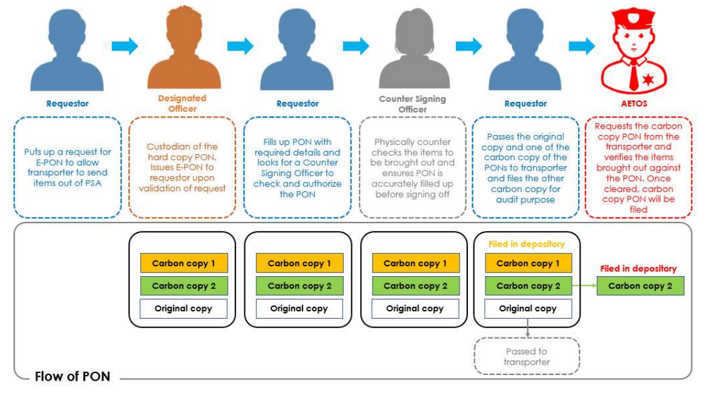

# Modus Ponens - PSA Code Sprint 2022

Try our application [here](https://modusponens.vmpsg.xyz/)!

## The Team

| Member                                              | Role                           |
| --------------------------------------------------- | ------------------------------ |
| [Koh Ming En](https://github.com/MingEn82)          | Team Lead                      |
| [Ng Ho Chi](https://github.com/nghochi123)          | Web Developer                  |
| [Chang Dao Zheng](https://github.com/changdaozheng) | Web & ML Developer             |
| [Chay Hui Xiang](https://github.com/chayhuixiang)   | Web Developer & UI/UX Designer |

## Introduction

Our project is a fully digital solution that heavily simplifies the issuance of PONs via thorough automation, user-friendly processes and computer vision.

We aim to take the original PON process, simplifying and digitizing it such that it becomes more environmentally friendly and efficient, without compromising the security of PSA's ports.

## Workflow

Use of our app comes in 3 steps:

1. Requestor makes a request for an E-PON. He enters relevant details and uploads an image. The image goes to our Object Detection server and we store all these details into our database. The E-PON is redirected to a Designated Officer for approval.

2. The Designated Officer approves the E-PON after confirming that everything is in check. E-PON is assigned to a random Counter-Signing Officer - not the requestor or DO. The E-PON's status is then updated, waiting for check and approval from AETOS.

3. The driver will receive the QR code to show the AETOS Officers, who will scan the QR code, leading them to the approval page. After the AETOS Officers have approved the E-PON form, everything is done!

After the third step, or if the request gets rejected at any step, the E-PON will automatically be archived and will not be editable any further.

## Tech Stack

### Front-end

[React](https://reactjs.org/) and [Next.js](https://nextjs.org/) were the frameworks of choice as it made the use of dynamic pages, as well as calling of APIs easy and convenient.

We chose to use [TailwindCSS](https://tailwindcss.com/) as our CSS framework as it makes it easy to standardize everything, from font sizes to colors and components, without restricting ourselves to a certain design.

### Back-end

For our database, we have gone with Google's [Firebase](https://firebase.google.com/) which provides a database out of the box without much setup - making it perfect for rapid prototyping, as well as for quickly storing and retrieving data.

Our computer vision model is built with [PyTorch](https://pytorch.org/) and served using [Flask](https://flask.palletsprojects.com/en/2.2.x/) with a [Docker](https://www.docker.com/) container on [Ainize](http://ainize.ai/).

### Designing and Brainstorming

Like normal web developers, we have chosen to develop and design our prototype on [Figma](https://www.figma.com/).

#### Mobile View

For our working prototype, we have only managed to find the time to develop the web application. However, we have come up with a mobile design on Figma. The end goal is to increase convenience by being able to view, handle and approve requests through mobile.

## Challenges we've faced

- The coordination and standardization of the design of multiple pages, which was made easier by using a standardized CSS framework as well as configuration files.
- Handling multiple promises in a row from passing data to our Object Detection API and back. (Async await hell)
